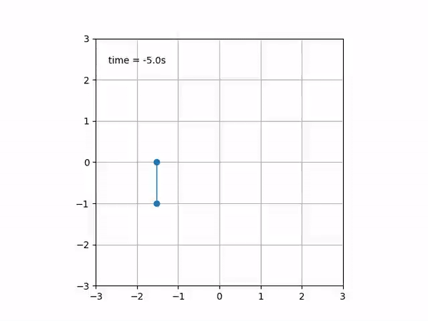
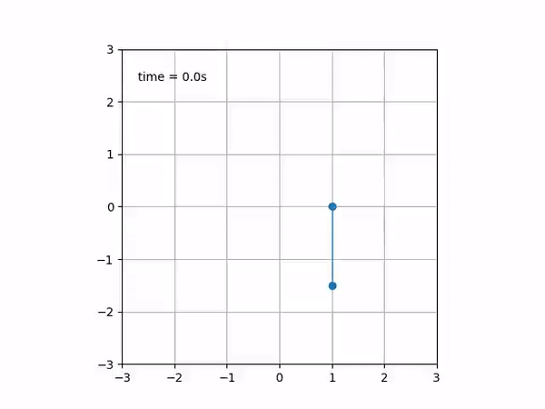
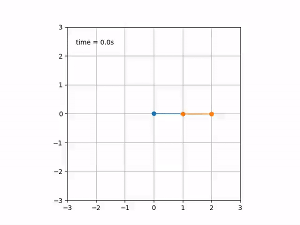
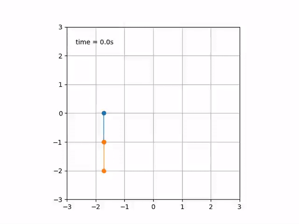
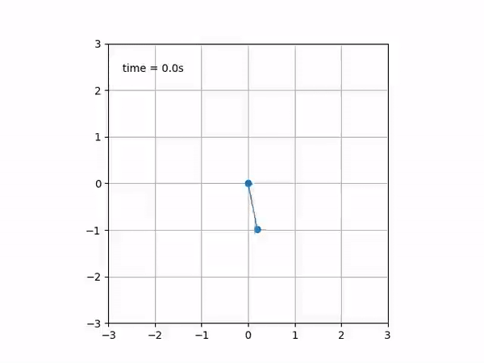

[](https://travis-ci.com/PabRod/pendulum)
[](https://codecov.io/gh/PabRod/pendulum)

# Pendulum simulator
Mechanical simulation of pendula.

By [Pablo Rodríguez-Sánchez](https://pabrod.github.io) [](https://orcid.org/0000-0002-2855-940X)

## Non-inertial pendula

|                            |                         |
|:--------------------------:|:-----------------------:|
|  |  |

## Double pendulum (inertial and non-inertial)

|                      |                        |
|:--------------------:|:----------------------:|
|  |  |

## Damped pendulum


# Installation
```
git clone https://github.com/PabRod/pendulum
cd pendulum
python setup.py install --user
```

# Tests
We are using `pytest` for unit testing. Run it via:

```
pytest
```

# Getting started
This is a minimal example of the usage of this package

```
## Import the required modules
from pendulum.models import *
import matplotlib.pyplot as plt

## Set-up your problem
l = 1 # length
g = 9.8 # Gravity
d = 1 # Damping

ts = np.linspace(0, 10, 1000) # Simulation time
yinit = (0, 1) # Initial condition (th_0, w_0)

## Solve it
sol = pendulum(yinit, ts, l, g, d)

## Plot results
fig, axs = plt.subplots(1, 1)
plt.plot(ts, sol[:,0], label = r'$\theta$')
plt.plot(ts, sol[:,1], label = r'$\omega$')

plt.legend()
plt.show()
```

For further examples, see:

- [Simple pendulum](example_script.py)
- [Double pendulum](example_double_pendulum.py)
- [Non-inertial simple pendulum (animated)](animation_nipendulum.py)
- [Non-inertial double pendulum (animated)](animation_double_pendulum.py)
