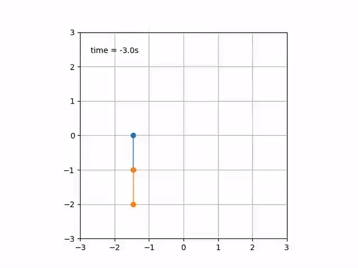

```{r setup, echo = FALSE, include = FALSE}
knitr::opts_chunk$set(echo = FALSE,
                      message = FALSE,
                      warning = FALSE)
```

```{r libraries}
# For calls to Python's matplotlib
library(reticulate)
matplotlib <- import("matplotlib", convert = TRUE)
matplotlib$use("Agg")

```

```{r rlibs}
library(dplyr)
```

# Installation

## Using git
```
git clone https://github.com/PabRod/pendulum
cd pendulum
python setup.py install --user
```

## Python modules

The following modules will be needed:

```{python modules, echo = TRUE}
## Import the required modules
from pendulum.models import *
import matplotlib.pyplot as plt
import numpy as np
```

The following modules are optional, but recommended:

```{python modules-suggested, echo = TRUE}
# If using animations
import matplotlib.animation as animation

# If using data as input
from scipy.interpolate import interp1d
import pandas as pd
```

# Examples

## Simple pendulum

### Problem set-up
The dynamics of a simple pendulum are characterized by its length $l$, the damping constant $d$ and the acceleration of gravity $g$.

```{python simple, echo = TRUE}
## Set-up your problem
l = 1.5 # Length
g = 9.8 # Gravity
d = 0.5 # Damping
```

For non-inertial pendula, we also have to input the pivot's movement. The natural way of coding movement is a time-dependent function for each coordinate. In the present case we want to use a sudden movement to the right happening at $t = 0$. These equations will do:

$$
\begin{cases}
  x(t) &= \arctan(5t) \\
  y(t) &= 0
\end{cases}
$$

```{python mov, echo = TRUE}
# Pivot's position
## The pivot is moving, so its position is a function of time
pos_x = lambda t : np.arctan(5*t)
pos_y = 0
```

As in any other mechanical problem, we need to introduce the initial conditions $(\theta_0, \omega_0)$ and the simulation times.

```{python init, echo = TRUE}
ts = np.linspace(-5, 10, 1000) # Simulation time
yinit = (0, 0) # Initial condition (th_0, w_0)
```

### Problem solving

Now we are ready to solve our problem:
```{python solve, echo = TRUE}
## Solve it
sol = pendulum(yinit, ts, pos_x, pos_y, l = l, g = g, d = d)
```

The object `sol` contains the simulated time series of $\theta$ (row 0) and $\omega$ (row 1). Plotting them we obtain:

```{python plot-simple, fig.align = 'center'}
fig, axs = plt.subplots(1, 1)
plt.plot(ts, sol[:,0], label = r'$\theta$')
plt.plot(ts, sol[:,1], label = r'$\omega$')

plt.xlabel('time')
plt.ylabel('states')

plt.legend()
plt.show()

```

```{r animate, fig.align = 'center'}
if(knitr::opts_knit$get("rmarkdown.pandoc.to") == "html") {
  # Include animated gif
  knitr::include_graphics('../figs/displacement.gif') 
} else {
  # Do nothing. You can't print an animation
  invisible()
}
```


## Double pendulum

### Problem set-up
The dynamics of a double pendulum are characterized by both lengths $(l_0, l_1)$, masses $(m_0, m_1)$ and the acceleration of gravity $g$.

```{python double, echo = TRUE}
## Set-up your problem
m = (2, 1) # Masses
l = (1, 1) # Lengths
g = 9.8 # Gravity
```

For the pivot's movement we want to use a sudden movement to the right. These equations will do:

$$
\begin{cases}
  x(t) &= \arctan(3t) \\
  y(t) &= 0
\end{cases}
$$

```{python 2mov, echo = TRUE}
# Pivot's position
## The pivot is moving, so its position is a function of time
pos_x = lambda t : np.arctan(3*t)
pos_y = 0
```

As in any other mechanical problem, we need to introduce the initial conditions $(\theta_0, \omega_0, \theta_1, \omega_1)$ and the simulation times.

```{python 2init, echo = TRUE}
ts = np.linspace(-3, 8, 1000) # Simulation time
yinit = (0, 0, 0, 0) # Initial condition (th_1, w_1, th_2, w_2)
```

### Problem solving

Now we are ready to solve our problem:
```{python 2solve, echo = TRUE}
## Solve it
sol = double_pendulum(yinit, ts, pos_x, pos_y, m = m, l = l, g = g)
```

The object `sol` contains the simulated time series. Each row represents a state, and each column corresponds to a simulated time.

|   State    | Row |
|:----------:|:---:|
| $\theta_0$ | $0$ |
| $\omega_0$ | $1$ |
| $\theta_1$ | $2$ |
| $\omega_1$ | $3$ |

Plotting them:


```{python 2plot, fig.align = 'center'}
fig, axs = plt.subplots(2, 1)
axs[0].plot(ts, sol[:,0], label = r'$\theta_0$')
axs[0].plot(ts, sol[:,2], label = r'$\theta_1$')

axs[1].plot(ts, sol[:,1], label = r'$\omega_0$')
axs[1].plot(ts, sol[:,3], label = r'$\omega_1$')

axs[0].set_ylabel(r'$\theta_i$')
axs[0].legend()
axs[1].set_xlabel('time')
axs[1].set_ylabel(r'$\omega_i$')
axs[1].legend()

plt.show()

```

```{r 2animate, fig.align = 'center'}
if(knitr::opts_knit$get("rmarkdown.pandoc.to") == "html") {
  # Include animated gif
   
} else {
  # Do nothing. You can't print an animation
  invisible()
}
```
